# Tutorial: cat_vs_dog_classifer

This project is an **interactive web application** that classifies images as either a *cat* or a *dog*. Users can easily upload an image, and the app will process it using a **pre-trained deep learning model** to provide a real-time prediction with a confidence score.


## Visual Overview


## Chapters

1. [Streamlit Web App
](01_streamlit_web_app_.md)
2. [Prediction Logic
](02_prediction_logic_.md)
3. [Image Preprocessing
](03_image_preprocessing_.md)
4. [Convolutional Neural Network (CNN) Model
](04_convolutional_neural_network__cnn__model_.md)
5. [Model Training Pipeline
](05_model_training_pipeline_.md)

# Chapter 1: Streamlit Web App

Imagine you have a brilliant "brain" that can tell if an animal in a picture is a cat or a dog. That's what our `cat_vs_dog_classifer` project is all about! But how do you let other people, or even yourself, use this brain without writing complex code every time? How do they "talk" to it and "see" its answers?

This is where a **web application** comes in! Think of it like building a friendly storefront for your amazing animal-detecting brain. People can walk in, drop off a picture, and immediately see the result on a screen. Our project uses something called **Streamlit** to build this interactive storefront.

The main goal of this chapter is to understand how Streamlit helps us create a user-friendly interface where you can:

1.  **Upload an image** (like bringing a picture to the storefront).
2.  **See the uploaded image** displayed right there.
3.  **Get the prediction** (is it a cat or a dog?) shown clearly on the screen.

Let's dive into how Streamlit makes this possible!

## What is Streamlit?

Streamlit is a special tool that lets you turn simple Python scripts into interactive web applications. You don't need to know complicated web development languages like HTML, CSS, or JavaScript. If you can write Python, you can build a web app with Streamlit!

The core idea is simple: you use `st.` functions (like `st.title`, `st.write`, `st.image`, etc.) in your Python code, and Streamlit automatically turns them into interactive parts of a web page.

## Building Our Web Interface

Let's look at the `cat_vs_dog.py` file, which contains all the code for our web app. We'll break down the parts that create the user interface using Streamlit.

### Setting Up the Page

First, we need to tell Streamlit how our web page should look and what its main title is.

```python
import streamlit as st

# ... (other imports for later chapters)

st.set_page_config(page_title="Cat vs Dog Classifier", layout="wide")
st.title("🐶🐱 Cat vs Dog Classifier")
st.write("Upload an image to find out whether it's a cat or a dog!")
```

*   `import streamlit as st`: This line is like saying, "Hey Python, I want to use the Streamlit library, and I'll call it `st` for short."
*   `st.set_page_config(...)`: This sets up some basic things for our web page, like the title that appears in the browser tab and how the content is laid out. `layout="wide"` means it will try to use more of your screen space.
*   `st.title(...)`: This displays the main, big title on your web page.
*   `st.write(...)`: This is a super versatile function that can display text, numbers, data, and more. Here, we use it to show a short description under the title.

When you run this code, Streamlit automatically creates a web page that looks something like this:

```
+-------------------------------------+
| Cat vs Dog Classifier (Browser Tab) |
+-------------------------------------+
|                                     |
| 🐶🐱 Cat vs Dog Classifier          |
| Upload an image to find out whether |
| it's a cat or a dog!                |
|                                     |
| ... (more content will go here)     |
+-------------------------------------+
```

### Allowing Users to Upload Images

The most important part of our "storefront" is where users can drop off their images. Streamlit provides a simple "widget" for this. A widget is just an interactive element on a web page, like a button, a text box, or an image uploader.

```python
# ... (previous code)

uploaded_file = st.file_uploader("Choose an image...", type=["jpg", "jpeg", "png"])
```

*   `st.file_uploader(...)`: This creates a button on your web app that, when clicked, opens a file selection window on your computer.
    *   `"Choose an image..."` is the text label next to the button.
    *   `type=["jpg", "jpeg", "png"]` tells Streamlit that we only want to accept image files in these formats.

When a user selects a file, `st.file_uploader` returns the uploaded file's information. If no file is uploaded yet, `uploaded_file` will be `None`.

### Displaying the Image and Results

Once an image is uploaded, we want to show it to the user and then later display the prediction results. We can use Streamlit's `st.image` function for displaying pictures and `st.columns` to arrange content side-by-side.

```python
# ... (previous code)

if uploaded_file is not None:
    # Open the image using PIL, a Python image library
    from PIL import Image
    image = Image.open(uploaded_file) 
    
    # Create two columns on the web page
    col1, col2 = st.columns([1, 1])
    
    with col1: # Everything inside this 'with' block goes into the first column
        st.image(image, caption="Uploaded Image", width=400) 
    
    with col2: # Everything inside this 'with' block goes into the second column
        st.write("Processing image...")
        # ... (image processing and prediction logic happens here, explained in later chapters)
        
        # Displaying a success message (example of what will happen later)
        st.success(f"**Prediction:** Dog 🐶\n**Confidence:** 98.50%") 
```

*   `if uploaded_file is not None:`: This ensures that the code inside this block only runs *after* a user has successfully uploaded a file.
*   `image = Image.open(uploaded_file)`: This line uses the `Pillow` (PIL) library to open the uploaded file as an image object that Streamlit can display.
*   `st.columns([1, 1])`: This is a handy way to arrange your content into multiple columns. `[1, 1]` means we want two columns of equal width. You can have more columns and different widths (e.g., `[2, 1]` for a wider first column).
*   `with col1:` and `with col2:`: These "context managers" tell Streamlit to place the widgets defined inside them into the respective columns.
*   `st.image(...)`: This displays an image on the web page. You give it the image data, an optional `caption` (text below the image), and a `width` to control its size.
*   `st.write("Processing image...")`: As we saw before, this displays simple text.
*   `st.success(...)`: This displays a nice green box with a success message. Streamlit also has `st.error` (for red error boxes) and `st.warning` (for yellow warning boxes). These are great for giving users clear feedback!

Putting it all together, when a user uploads an image, the page will update dynamically:

```
+-------------------------------------+
| Cat vs Dog Classifier (Browser Tab) |
+-------------------------------------+
|                                     |
| 🐶🐱 Cat vs Dog Classifier          |
| Upload an image to find out whether |
| it's a cat or a dog!                |
|                                     |
| Choose an image... [Browse files]   |
|                                     |
| +---------------------+ +---------------------+
| |                     | | Processing image... |
| |  [Uploaded Image]   | |                     |
| |                     | | +-----------------+ |
| | Caption: Uploaded   | | | Prediction: Dog | |
| |          Image      | | | Confidence: 98% | |
| +---------------------+ +-----------------+ |
|                                             |
+---------------------------------------------+
```

### Giving Feedback with `st.spinner`

When our app is busy doing something (like processing an image or making a prediction), it's good to let the user know that something is happening. Otherwise, they might think the app is frozen!

```python
# ... (inside the col2 block after st.write("Processing image..."))

with st.spinner("Classifying..."):
    # This is where the actual prediction code runs (explained in later chapters)
    # For now, imagine it takes a moment.
    pass # Placeholder for actual prediction call
```

*   `with st.spinner("Classifying...")`: This creates a temporary loading spinner with the text "Classifying..." next to it. As long as the code inside this `with` block is running, the spinner will be visible. Once the code finishes (or an error occurs), the spinner automatically disappears. It's a neat way to show progress!

## How Streamlit Works Behind the Scenes

When you run a Streamlit app using `streamlit run cat_vs_dog.py`, here's a simplified look at what happens:


The key thing to understand about Streamlit is that **it re-runs your entire Python script from top to bottom every time you interact with a widget** (like uploading a file, typing text, or clicking a button).

This might seem a bit unusual at first, but it's what makes Streamlit so simple. You write your code almost like a regular script, and Streamlit handles all the complexities of updating the web page for you. It automatically figures out which parts of the page need to change based on the new results from your script.

## Conclusion

In this chapter, we explored the "storefront" of our `cat_vs_dog_classifer` project: the **Streamlit Web App**. You learned that Streamlit is a fantastic tool for building interactive web interfaces using just Python. We covered how to:

*   Set up your web page with `st.set_page_config`, `st.title`, and `st.write`.
*   Allow users to upload files using `st.file_uploader`.
*   Display images with `st.image` and arrange content using `st.columns`.
*   Provide user feedback with `st.success`, `st.error`, and `st.spinner`.

You now have a good grasp of how the user interacts with our application. But what happens *after* the image is uploaded? How does the "brain" actually figure out if it's a cat or a dog? That's what we'll explore in the next chapter, where we dive into the [Prediction Logic](02_prediction_logic_.md).

# Chapter 2: Prediction Logic

In [Chapter 1: Streamlit Web App](01_streamlit_web_app_.md), we learned how to build a friendly "storefront" for our cat vs. dog classifier using Streamlit. You saw how users can upload an image and how Streamlit displays it. But what happens **after** the image is uploaded? How does our "animal-detecting brain" actually look at the picture and decide if it's a cat or a dog?

This is where the **Prediction Logic** comes in! Think of this component as the "interpreter" or "decision-maker" of our project. Its job is to take the image, show it to the "brain" (our special computer model), and then translate the brain's technical answer into something we can easily understand: "It's a Dog!" or "It's a Cat!" along with how confident it is about its decision.

The main goal of this chapter is to understand the steps involved in turning an uploaded image into a clear, human-readable prediction.

## What is Prediction Logic?

Once you upload an image to our Streamlit app, the prediction logic component springs into action. It orchestrates a series of operations to give you the answer. Here's what it primarily does:

1.  **Takes the Prepared Image:** It receives an image that has already been made ready for our model. (Don't worry about *how* the image is prepared just yet; we'll cover that in [Chapter 3: Image Preprocessing](03_image_preprocessing_.md)!)
2.  **Feeds it to the Brain (CNN Model):** It passes this prepared image to our trained "brain" – a special kind of computer program called a [Convolutional Neural Network (CNN) Model](04_convolutional_neural_network__cnn__model_.md). The model processes the image and gives back a raw "score."
3.  **Interprets the Score:** The raw score from the model isn't immediately "cat" or "dog." It's usually a number, like 0.1 or 0.9. The prediction logic then takes this number and converts it into a clear label (cat or dog) and a confidence percentage.

Let's see how this interpretation happens in our code.

## The `predict` Function: Our Interpreter

In our `cat_vs_dog.py` file, there's a function called `predict`. This is the heart of our prediction logic.

```python
# ... (other code)

def predict(image):
    prediction = model.predict(image)[0]  # Get raw prediction score from the model
    label = 1 if prediction > 0.5 else 0  # Convert score to a label (e.g., dog=1, cat=0)
    confidence = float(prediction) if label == 1 else float(1 - prediction) # Calculate confidence
    return {"label": label, "confidence": confidence}

# ... (rest of the Streamlit app code)
```

Let's break down each line of this small but mighty function:

*   `prediction = model.predict(image)[0]`: This is where we talk to our "brain."
    *   `model.predict(image)`: This tells our trained [Convolutional Neural Network (CNN) Model](04_convolutional_neural_network__cnn__model_.md) to analyze the `image` it received.
    *   `[0]`: Our model gives back a list of predictions, even if there's only one. We take the first (and only) item from that list. This `prediction` will be a single number, usually between 0 and 1.
        *   **Analogy:** Imagine the model says, "I'm 0.9 sure it's a dog" (or a 90% chance it's class 1, which is "dog" in our case). Or "I'm 0.1 sure it's a dog" (meaning it's 10% sure it's a dog, so probably a cat).

*   `label = 1 if prediction > 0.5 else 0`: This line is a simple decision-maker.
    *   It checks if the `prediction` score is greater than `0.5`.
    *   If it is, we assign the `label` as `1` (which we've decided means "dog").
    *   If the score is `0.5` or less, we assign the `label` as `0` (which means "cat").
        *   **Analogy:** This is like setting a "vote threshold." If more than half the "vote" (0.5) goes to "dog," it's a dog. Otherwise, it's a cat.

*   `confidence = float(prediction) if label == 1 else float(1 - prediction)`: This calculates how sure the model is.
    *   If the `label` is `1` (dog), the `confidence` is simply the `prediction` score itself (e.g., 0.9 becomes 90% confident it's a dog).
    *   If the `label` is `0` (cat), the `confidence` is `1 - prediction` (e.g., if the prediction for dog was 0.1, then `1 - 0.1 = 0.9`, meaning 90% confident it's a cat).
        *   **Analogy:** If the brain says "0.9 for dog," it's 90% confident it's a dog. If it says "0.1 for dog," it's 90% confident it's *not* a dog (i.e., it's a cat).

*   `return {"label": label, "confidence": confidence}`: The function finally returns a clear dictionary containing the chosen `label` and its `confidence` score.

## How Prediction Logic Works in the App

When a user uploads an image, the Streamlit app (from [Chapter 1](01_streamlit_web_app_.md)) takes the raw image file. The overall flow then looks something like this:

```mermaid
sequenceDiagram
    participant User
    participant StreamlitApp
    participant ImagePreprocessing as 03_image_preprocessing_.md
    participant PredictionLogic as 02_prediction_logic_.md
    participant CNNModel as 04_convolutional_neural_network__cnn__model_.md

    User->>StreamlitApp: Uploads Image (e.g., cat.jpg)
    StreamlitApp->>ImagePreprocessing: Sends raw image for preparation
    Note over ImagePreprocessing: Resizes, normalizes pixels, reshapes
    ImagePreprocessing-->>StreamlitApp: Returns prepared image
    StreamlitApp->>PredictionLogic: Sends prepared image to 'predict' function
    PredictionLogic->>CNNModel: Feeds prepared image to model
    CNNModel-->>PredictionLogic: Returns raw prediction score (e.g., 0.2669)
    Note over PredictionLogic: Converts score to label (Cat) and confidence (73.31%)
    PredictionLogic-->>StreamlitApp: Returns {"label": Cat, "confidence": 73.31%}
    StreamlitApp->>User: Displays "Prediction: Cat 🐱, Confidence: 73.31%"
```



As you can see, the `PredictionLogic` acts as the crucial middleman, translating the complex output of the CNN model into an easy-to-understand result for the user.

## Example Predictions from our `cnn_source.ipynb`

Our `cnn_source.ipynb` notebook (where the model was trained) contains examples of how predictions look. Let's revisit a couple of those:

| Image | Raw Prediction (for "Dog") | Calculated Label | Confidence |
| :---- | :------------------------- | :--------------- | :--------- |
| `cat1.jpg` | `0.2669` | Cat (0) | `(1 - 0.2669) * 100 = 73.31%` |
| `dog2.jpg` | `0.9605` | Dog (1) | `0.9605 * 100 = 96.05%` |

These examples clearly show how a raw score (like 0.2669 or 0.9605) gets transformed by our prediction logic into a meaningful answer.

## Conclusion

In this chapter, you've learned about the vital role of the **Prediction Logic** in our `cat_vs_dog_classifer` project. It's the component that understands what our "brain" (the CNN model) is saying and translates it into an understandable answer, complete with a confidence level.

You now know how the user interacts with the app (Chapter 1) and how the app then interprets the "brain's" answer. But we still have a missing piece: How does the image get **prepared** for the "brain"? That's exactly what we'll explore in the next chapter, where we dive into [Image Preprocessing](03_image_preprocessing_.md).

# Chapter 3: Image Preprocessing

In [Chapter 1: Streamlit Web App](01_streamlit_web_app_.md), we built our friendly "storefront" where you can upload an image. Then, in [Chapter 2: Prediction Logic](02_prediction_logic_.md), we saw how our app takes that image and feeds it to our "animal-detecting brain" (the CNN model) to get a prediction.

But there's a super important step in between! Imagine you're a chef, and you have a complex recipe that requires very specific ingredients: carrots must be chopped into 1-inch cubes, flour must be measured precisely, and so on. You can't just throw raw, unmeasured ingredients into the pot and expect a perfect dish!

It's the same with our `cat_vs_dog_classifier`. Our powerful "brain" (the CNN model) has a very specific way it expects to "see" images. It needs them to be prepared in a **standardized format**. This is exactly what **Image Preprocessing** does: it takes any uploaded image and gets it ready for the model, just like a chef prepares ingredients for a recipe.

The main goal of this chapter is to understand how we transform an uploaded image into the perfect format for our CNN model.

## Why Do We Need Image Preprocessing?

Every image you take with a phone or download from the internet is different. They can be:
*   **Different sizes:** A picture taken with a professional camera might be huge (like 4000x3000 pixels), while one from an old phone might be tiny (like 640x480 pixels).
*   **Different "brightness" or "color":** The actual numbers (pixel values) that make up the image can vary a lot, making some images look dark and others bright.

Our CNN model, however, is like a strict teacher. It expects all images to be exactly the same size and to have their color/brightness values adjusted in a specific way. If we don't preprocess the images, our model won't understand them, and it won't be able to tell if it's a cat or a dog!

## The Key Steps of Image Preprocessing

Our image preprocessing involves three main steps:

1.  **Resizing Images:** Making sure all images have the same dimensions.
2.  **Normalizing Pixel Values:** Adjusting the brightness/color values to a consistent range.
3.  **Expanding Dimensions:** Adding an extra "wrapper" around the image so the model can process it correctly.

Let's look at the `preprocess_image` function in our `cat_vs_dog.py` file, which handles all these steps:

```python
import numpy as np
from PIL import Image

def preprocess_image(image):
    # Step 1: Resizing the image
    image = image.resize((256, 256)) 
    
    # Step 2: Normalizing pixel values
    image = np.array(image) / 255.0  
    
    # Step 3: Expanding dimensions
    image = np.expand_dims(image, axis=0)  
    
    return image
```

Let's break down each line.

### Step 1: Resizing Images

```python
    image = image.resize((256, 256))
```

*   `image.resize((256, 256))`: Our CNN model was trained with images that were all exactly `256` pixels wide and `256` pixels tall. This line uses the `Pillow` (PIL) library to change the size of any uploaded image to this standard dimension.
    *   **Analogy:** This is like chopping all your vegetables into perfectly uniform pieces. No matter if you start with a big carrot or a small one, they all end up as 1-inch cubes.

### Step 2: Normalizing Pixel Values

```python
    image = np.array(image) / 255.0
```

*   `np.array(image)`: First, we convert our image (which is a PIL Image object) into a `NumPy` array. Think of a NumPy array as a grid of numbers where each number represents a pixel's color value (from 0 to 255 for each color channel like Red, Green, Blue).
*   `/ 255.0`: This is the normalization step. We divide every single pixel value in the image by `255.0` (which is the maximum possible pixel value).
    *   **Example:** If a pixel had a value of `255` (very bright white), it becomes `1.0`. If it had a value of `0` (very dark black), it remains `0.0`. If it was `127.5` (mid-gray), it becomes `0.5`.
    *   **Analogy:** This is like making sure all your ingredient measurements are in the same unit. Instead of "a handful of flour" or "a cup of flour," everything is scaled to be a value between 0 and 1. This helps our model learn more effectively because all the input numbers are within a small, predictable range.

### Step 3: Expanding Dimensions

```python
    image = np.expand_dims(image, axis=0)
```

*   `np.expand_dims(image, axis=0)`: This might seem a bit tricky, but it's a common requirement for many machine learning models. Our CNN model expects images to be given in "batches," even if we're only making a prediction for *one* image at a time.
    *   Normally, an image might be a 3D array (height, width, color channels, e.g., `(256, 256, 3)`).
    *   The `np.expand_dims` function adds a new dimension at the beginning, making it a 4D array (batch size, height, width, color channels, e.g., `(1, 256, 256, 3)`). The `1` means there's a batch of one image.
    *   **Analogy:** Imagine the chef always expects ingredients to come in a "basket," even if there's only one carrot in the basket. We're just putting our single processed image into a "basket" (the extra dimension) for the model.

## How Image Preprocessing Works in Our App

Let's revisit the flow of our app, now including the Image Preprocessing step:

```mermaid
sequenceDiagram
    participant User
    participant StreamlitApp
    participant ImagePreprocessingFunc as preprocess_image()
    participant PredictionLogic as predict()
    participant CNNModel as Model

    User->>StreamlitApp: Uploads Image (e.g., dog.jpg - any size/format)
    StreamlitApp->>ImagePreprocessingFunc: Sends raw uploaded image (PIL Image object)
    Note over ImagePreprocessingFunc: 1. Resizes to 256x256<br>2. Normalizes pixels (0-1)<br>3. Adds batch dimension (1, 256, 256, 3)
    ImagePreprocessingFunc-->>StreamlitApp: Returns processed image (NumPy array)
    StreamlitApp->>PredictionLogic: Sends processed image
    PredictionLogic->>CNNModel: Feeds processed image
    CNNModel-->>PredictionLogic: Returns raw prediction score (e.g., 0.9605)
    Note over PredictionLogic: Converts score to label (Dog) and confidence (96.05%)
    PredictionLogic-->>StreamlitApp: Returns {"label": Dog, "confidence": 96.05%}
    StreamlitApp->>User: Displays "Prediction: Dog 🐶, Confidence: 96.05%"
```



As you can see, the `preprocess_image` function is the vital bridge that transforms the messy, real-world image into a clean, model-ready input. Our [Chapter 2: Prediction Logic](02_prediction_logic_.md) then simply takes this perfectly prepared image and asks the [Chapter 4: Convolutional Neural Network (CNN) Model](04_convolutional_neural_network__cnn__model_.md) for a prediction.

### Preprocessing in `cat_vs_dog.py`

Here's how `preprocess_image` is used in our main Streamlit app file:

```python
# ... (imports and model loading from previous chapters)
import numpy as np # Needed for array and expand_dims
from PIL import Image # Needed for Image.open and Image.resize

# ... (preprocess_image function definition shown above)

# ... (predict function definition from Chapter 2)

if uploaded_file is not None:
    image = Image.open(uploaded_file) 
    # ... (column setup)
    with col2:
        st.write("Processing image...")
        # Call our preprocessing function here!
        processed_image = preprocess_image(image)
        
        with st.spinner("Classifying..."):
            result = predict(processed_image)
        
        # ... (display results)
```

The `processed_image` variable now holds the image in the exact format our CNN model expects.

## Conclusion

In this chapter, we explored the crucial concept of **Image Preprocessing**. You learned why it's necessary to standardize images for a machine learning model and the three main steps involved in our project:

*   **Resizing** to a consistent 256x256 pixels.
*   **Normalizing** pixel values from 0-255 to 0-1.
*   **Expanding Dimensions** to add a "batch" dimension.

This preparation ensures that our "animal-detecting brain" receives images in a format it can perfectly understand. Now that our ingredients are perfectly prepared, it's time to meet the "chef" itself: the **Convolutional Neural Network (CNN) Model**, which we'll dive into in the next chapter: [Convolutional Neural Network (CNN) Model](04_convolutional_neural_network__cnn__model_.md).

# Chapter 4: Convolutional Neural Network (CNN) Model

In [Chapter 1: Streamlit Web App](01_streamlit_web_app_.md), we built the user-friendly interface. In [Chapter 2: Prediction Logic](02_prediction_logic_.md), we saw how our app takes an image and asks a "brain" for a prediction. Then, in [Chapter 3: Image Preprocessing](03_image_preprocessing_.md), we learned how that image is meticulously prepared before being shown to the "brain."

Now, it's time to finally meet the **"brain" itself**: the **Convolutional Neural Network (CNN) Model**!

## What is the CNN Model? (Our Image Expert)

Imagine you hire a super-specialized expert whose only job is to tell if a picture contains a cat or a dog. This expert has spent years studying countless cat and dog photos, learning to spot tiny details like the shape of an ear, the texture of fur, or the way eyes reflect light. When you show them a new picture, they instantly recognize these patterns and give you an answer.

Our CNN model is exactly like that specialized expert. It's the "deep learning brain" of our application. After being "trained" (which we'll cover in [Chapter 5: Model Training Pipeline](05_model_training_pipeline_.md)), it becomes incredibly skilled at recognizing the unique visual patterns that define "cat" and "dog" in images.

The main goal of this chapter is to understand, at a very high level, how this amazing "brain" works and why it's so good at understanding images.

## How CNNs "See" Images (It's Different from How We See)

Unlike humans who see an entire picture at once, a CNN "sees" images by breaking them down and looking for very specific patterns. Think of it as a step-by-step process:

1.  **Spotting Simple Shapes (Convolutional Layers):**
    *   Imagine having many tiny magnifying glasses, each designed to spot a very simple shape like a straight line, a curve, or a specific color blob. These magnifying glasses are called **"filters"** or **"kernels."**
    *   A **Convolutional Layer** works by sliding these filters over every tiny part of the image. When a filter finds the shape it's looking for, it "lights up" that spot on a new image, creating a "feature map."
    *   **Analogy:** This is like a detective looking for clues. One detective only looks for red cars, another for broken windows, and so on. Each creates a map of where they found their specific clue.

2.  **Highlighting Important Features (Pooling Layers):**
    *   After spotting many simple shapes, a **Pooling Layer** steps in. Its job is to shrink the feature maps, keeping only the most important information. This helps the CNN focus on the key patterns and reduces unnecessary details.
    *   **Analogy:** This is like a detective's assistant who takes all the detailed clue maps and summarizes them, saying, "Okay, we found a lot of red cars in this area, and a lot of broken windows over there." They keep the highlights, discarding redundant info.

3.  **Building Up Complexity (More Layers!):**
    *   CNNs aren't just one layer. They stack many Convolutional and Pooling layers together! The first layers find simple lines and shapes. Later layers combine these simple shapes to find more complex patterns, like "an eye" or "a furry texture." Even later layers combine these to spot "a cat's face" or "a dog's snout."
    *   **Analogy:** Our junior detectives (early layers) find simple clues. Their summaries go to mid-level detectives (middle layers) who combine those clues to find bigger patterns. Finally, everything goes to the chief detective (last layers) who combines all findings to make the final decision.

4.  **Making the Final Decision (Fully Connected Layers):**
    *   After all the complex pattern recognition, the final layers of a CNN are **"Fully Connected Layers."** These are like the "decision-making" part. They take all the refined, high-level features learned from the previous layers and use them to decide the final category: "cat" or "dog."
    *   **Analogy:** The chief detective takes all the summarized reports and evidence from their team and, based on all the learned patterns, confidently declares, "It's a cat!" or "It's a dog!"

## Our CNN Model in `cnn_source.ipynb`

Our `cat_dog_model.keras` file contains the pre-trained "brain." When you run our Streamlit app, the first thing it does is load this model:

```python
# ... (other imports)
from tensorflow import keras

MODEL_PATH = "cat_dog_model.keras"  # or the actual path to your model
model = keras.models.load_model(MODEL_PATH)
```

This line loads our entire pre-trained expert. The `model` variable now holds all the knowledge and structure of our CNN.

When our `predict` function (from [Chapter 2: Prediction Logic](02_prediction_logic_.md)) is called, it simply asks this loaded `model` for a prediction:

```python
# ... (inside the predict function)
prediction = model.predict(image)[0]
# ... (rest of the prediction logic)
```

`model.predict(image)` is the moment our prepared image (from [Chapter 3: Image Preprocessing](03_image_preprocessing_.md)) is given to the CNN for analysis.

## A Look Under the Hood: The CNN's Architecture

The `cnn_source.ipynb` notebook is where our "expert" was built and trained. Let's look at the simplified blueprint of our CNN model. It's built using `tf.keras.Sequential`, which means we stack layers one after another.

```python
model = Sequential()

# Input Layer: This is where our 256x256 pixel images (with 3 color channels) enter
model.add(Input(shape=(256, 256, 3)))

# --- Block 1 of feature extraction ---
model.add(Conv2D(128, kernel_size=(3, 3), padding='same', activation='relu')) # Pattern detector
model.add(BatchNormalization()) # Helps stabilize learning
model.add(MaxPooling2D(pool_size=(2, 2), strides=2, padding='valid')) # Shrinks and highlights

# --- Block 2 (similar to Block 1, but learns different features) ---
model.add(Conv2D(64, kernel_size=(3, 3), padding='same', activation='relu'))
model.add(BatchNormalization())
model.add(MaxPooling2D(pool_size=(2, 2), strides=2, padding='valid'))

# --- More Blocks to learn increasingly complex features ---
model.add(Conv2D(32, kernel_size=(3, 3), padding='same', activation='relu'))
model.add(BatchNormalization())
model.add(MaxPooling2D(pool_size=(2, 2), strides=2, padding='valid'))

model.add(Conv2D(32, kernel_size=(3, 3), padding='same', activation='relu'))
model.add(BatchNormalization())
model.add(MaxPooling2D(pool_size=(2, 2), strides=2, padding='valid'))

model.add(Conv2D(16, kernel_size=(3, 3), padding='same', activation='relu'))
model.add(BatchNormalization())
model.add(MaxPooling2D(pool_size=(2, 2), strides=2, padding='valid'))

# --- Flattening for final decision ---
model.add(Flatten()) # Prepare data for decision layers

# --- Fully Connected Layers (The Decision Makers) ---
model.add(Dense(64, activation='relu')) # First decision layer
model.add(Dropout(0.4)) # Helps prevent memorizing training images

model.add(Dense(32, activation='relu')) # Second decision layer
model.add(Dropout(0.4))

model.add(Dense(8, activation='relu')) # Third decision layer
model.add(Dropout(0.3))

model.add(Dense(1, activation='sigmoid')) # Final output (1 for dog, 0 for cat)
```

### Explaining the Layers:

*   **`Input(shape=(256, 256, 3))`**: This tells the CNN what kind of images it expects: `256` pixels wide, `256` pixels tall, and `3` color channels (Red, Green, Blue). This is why image preprocessing is so important!
*   **`Conv2D(...)` (Convolutional Layer)**: This is where the magic happens! It's the "pattern detector" layer.
    *   `128`, `64`, `32`, `16`: These numbers refer to the "number of filters." More filters mean the layer can learn to spot more different kinds of patterns. Notice how the number of filters generally decreases as we go deeper; earlier layers find many simple patterns, later layers combine them into fewer, more complex ones.
    *   `kernel_size=(3, 3)`: This is the size of our "magnifying glass" (filter) – a 3x3 pixel square.
    *   `activation='relu'`: This is a mathematical function that helps the network learn complex relationships. Think of it as deciding whether a detected pattern is "important enough" to pass along.
*   **`BatchNormalization()`**: This is like a "traffic controller" for the numbers flowing through the network. It helps keep the numbers in a healthy range, making the learning process faster and more stable.
*   **`MaxPooling2D(...)` (Pooling Layer)**: This layer helps simplify the information.
    *   `pool_size=(2, 2)`: It looks at 2x2 pixel areas.
    *   `strides=2`: It moves 2 pixels at a time, effectively cutting the size of the image in half. This reduces the amount of data the next layers have to process, making the network more efficient and less prone to memorizing specific image locations.
*   **`Flatten()`**: After several `Conv2D` and `MaxPooling2D` layers, our image data is still in a 3D (height, width, features) format. The `Flatten` layer takes this 3D data and squishes it into a single long line of numbers. This is necessary because the next layers (`Dense` layers) expect a flat list of numbers as input.
*   **`Dense(...)` (Fully Connected Layer)**: These are the traditional "neural network" layers where every input is connected to every output. They're good at making final decisions based on the patterns passed to them.
    *   `64`, `32`, `8`: These are the number of "neurons" in each layer. More neurons allow for more complex decision-making.
    *   `activation='relu'`: Same activation as before.
    *   `activation='sigmoid'` (for the last `Dense` layer): This specific activation function is used for "binary classification" (like cat or dog). It outputs a number between 0 and 1, which we can interpret as the probability of being a "dog" (as seen in [Chapter 2](02_prediction_logic_.md)).
*   **`Dropout(...)`**: This is a clever trick to prevent the model from "memorizing" its training examples (which is bad because it won't perform well on new, unseen images). During training, it randomly "turns off" a percentage of neurons (e.g., `0.4` means 40% are turned off). This forces the network to find multiple ways to recognize patterns, making it more robust.

When you run `model.summary()` in the notebook, you get a detailed printout like a blueprint of our expert, showing each layer and how many "parameters" (learnable numbers) it has.

## The CNN in Our Application Flow

Let's look at the overall flow of our `cat_vs_dog_classifer` project, now with our CNN "brain" fully integrated:

```mermaid
sequenceDiagram
    participant User
    participant StreamlitApp
    participant ImagePreprocessing as preprocess_image()
    participant CNNModel as model (the brain)
    participant PredictionLogic as predict()

    User->>StreamlitApp: Uploads Image (raw, any size)
    StreamlitApp->>ImagePreprocessing: Sends raw image for preparation
    Note over ImagePreprocessing: 1. Resizes to 256x256<br>2. Normalizes pixels (0-1)<br>3. Adds batch dimension (1, 256, 256, 3)
    ImagePreprocessing-->>StreamlitApp: Returns processed image (NumPy array)
    StreamlitApp->>PredictionLogic: Sends processed image to 'predict' function
    PredictionLogic->>CNNModel: Feeds processed image to model's 'predict' method
    Note over CNNModel: CNN processes image layer by layer<br>extracting features and making a raw score (0-1)
    CNNModel-->>PredictionLogic: Returns raw prediction score (e.g., 0.9605 for dog)
    Note over PredictionLogic: Converts score to label (Dog) and confidence (96.05%)
    PredictionLogic-->>StreamlitApp: Returns {"label": Dog, "confidence": 96.05%}
    StreamlitApp->>User: Displays "Prediction: Dog 🐶, Confidence: 96.05%"
```



As you can see, the CNN Model is the central component where the actual "thinking" about the image happens. It takes the perfectly prepared image, applies all its learned patterns, and produces a score that the prediction logic then translates for us.

## Conclusion

In this chapter, we unveiled the core "brain" of our `cat_vs_dog_classifer` project: the **Convolutional Neural Network (CNN) Model**. You learned that CNNs are specialized experts at understanding images by:

*   Using **Convolutional Layers** to spot patterns.
*   Using **Pooling Layers** to simplify information.
*   Stacking many layers to learn complex features.
*   Using **Fully Connected Layers** to make a final decision.

You now have a foundational understanding of how our model processes images. But how did our CNN become such an expert in the first place? How did it learn to distinguish between cats and dogs? That's the fascinating process of **Model Training**, which we'll explore in the next chapter: [Model Training Pipeline](05_model_training_pipeline_.md).

# Chapter 5: Model Training Pipeline

In [Chapter 4: Convolutional Neural Network (CNN) Model](04_convolutional_neural_network__cnn__model_.md), we finally met the "brain" of our `cat_vs_dog_classifer` project: the **Convolutional Neural Network (CNN)**. You learned how this special computer program is designed to "see" and understand patterns in images, allowing it to tell cats from dogs.

But how did this "brain" become so smart? It's not born with this knowledge! Just like a student needs to study and practice to become an expert, our CNN model needs to go through a rigorous **Model Training Pipeline**.

## What is the Model Training Pipeline?

Imagine you're preparing a student for a big exam on identifying cats and dogs. You wouldn't just give them a single picture and expect them to learn! Instead, you'd:

1.  **Give them lots of study materials:** Thousands of cat and dog pictures.
2.  **Teach them how to prepare:** Show them how to zoom in, rotate, or crop pictures to see them from different angles.
3.  **Provide a curriculum:** Structure their learning from simple shapes to complex features.
4.  **Set up practice exams:** Regularly test their knowledge and provide feedback.
5.  **Monitor their progress:** Make sure they're improving and not just memorizing the practice questions.
6.  **Certify them:** Once they're good enough, they get their "expert" certification.

The **Model Training Pipeline** is exactly this comprehensive curriculum for our AI "student." It's the complete, step-by-step process of teaching our CNN model to become an expert at cat and dog classification.

The main goal of this chapter is to understand the different stages of this pipeline, from gathering data to making our model a certified "cat-or-dog" expert!

## The Stages of Our Training Pipeline

Our training pipeline, which is primarily found in the `cnn_source.ipynb` notebook, involves several key stages:

1.  **Downloading and Extracting the Dataset:** Getting the "study materials" (images).
2.  **Preparing and Augmenting the Image Data:** Getting the "study materials" ready and making them more diverse.
3.  **Defining the Neural Network's Architecture:** Building the "student's brain" (covered in [Chapter 4](04_convolutional_neural_network__cnn__model_.md)).
4.  **Compiling the Model:** Setting up the "teacher" (how the model learns and is graded).
5.  **Fitting the Model (Iterative Learning):** The actual "practice sessions" and "studying."
6.  **Saving the Trained Model:** Giving our "student" their "certification."

Let's walk through each of these stages.

### Stage 1: Downloading and Extracting the Dataset

Our "study materials" come from a website called Kaggle, which is a great place for datasets. We'll use a `dogs-vs-cats` dataset that contains thousands of pictures.

First, we need to download the dataset and then "unzip" it so we can use the images. This part is done using command-line tools in the notebook.

```python
# Create a folder for Kaggle credentials
!mkdir -p ~/.kaggle
# Copy your Kaggle API key (kaggle.json) to the folder
!cp kaggle.json ~/.kaggle/
# Download the dataset from Kaggle
!kaggle datasets download -d salader/dogs-vs-cats
```

After downloading, the dataset is usually packed into a `.zip` file, like a big compressed folder. We need to "extract" it to get the individual image files.

```python
import zipfile

# Open the downloaded zip file
zip_ref = zipfile.ZipFile('/content/dogs-vs-cats.zip','r')
# Extract all its contents to the /content folder
zip_ref.extractall('/content')
# Close the zip file
zip_ref.close()
```

This will create `train` and `test` folders inside `/content`, each containing `cats` and `dogs` subfolders with all the images.

### Stage 2: Preparing and Augmenting the Image Data

Our CNN "brain" expects images to be in a very specific format (remember [Chapter 3: Image Preprocessing](03_image_preprocessing_.md)?). During training, we do a bit more than just basic preprocessing: we also **augment** the data.

**What is Data Augmentation?**
Imagine a student learning to identify dogs. If they only ever see pictures of dogs facing left, they might struggle with a dog facing right! Data augmentation is like teaching the student to recognize the same object even if it's slightly changed (e.g., flipped, rotated, zoomed).

This creates new "versions" of our existing images, making our model more robust and preventing it from simply memorizing the exact pictures it was trained on.

Here's how we prepare and augment the data:

```python
import tensorflow as tf

# Load training and testing images from folders
# image_size: All images will be resized to 256x256 pixels
# batch_size: Images are fed to the model in small groups (batches of 32)
# label_mode='int': Labels (cat/dog) are converted to numbers (0 or 1)
train_data = tf.keras.utils.image_dataset_from_directory(
    directory='/content/train',
    image_size=(256, 256),
    batch_size=32,
    label_mode='int'
)

test_data = tf.keras.utils.image_dataset_from_directory(
    directory='/content/test',
    image_size=(256, 256),
    batch_size=32,
    label_mode='int'
)
```

Next, we normalize the pixel values (scale them from 0-255 to 0-1) and apply data augmentation.

```python
# Function to normalize pixel values
def process(image, label):
    # Convert pixel values from 0-255 to 0-1 (float32 type)
    image = tf.cast(image / 255., tf.float32)
    return image, label

# Apply normalization to both training and test datasets
train_data = train_data.map(process)
test_data = test_data.map(process)

# Define data augmentation layers
data_agu = tf.keras.Sequential([
    tf.keras.layers.RandomFlip('horizontal'),  # Flip images left/right randomly
    tf.keras.layers.RandomRotation(0.2),      # Rotate images by a small amount randomly
    tf.keras.layers.RandomZoom(0.2)           # Zoom in/out randomly
])

# Function to apply augmentation
def augment(image, label):
    image = data_agu(image) # Apply the augmentation layers
    return image, label

# Apply augmentation ONLY to the training data
train_data = train_data.map(augment)
```

*   `tf.keras.utils.image_dataset_from_directory`: This is a super helpful function that automatically finds images in your folders, labels them based on folder names, and resizes them. It also groups them into "batches" for training.
*   `process` function: This scales the pixel values from 0-255 to 0-1, which is important for neural networks.
*   `data_agu` (data augmentation): This `Sequential` model is like a mini-pipeline for augmentation. It defines random operations like flipping, rotating, and zooming.
*   `augment` function: This applies the `data_agu` operations to each image. **Important**: We only apply augmentation to the `train_data`. We want our `test_data` to be a true, unchanged representation of new images to check our model's real performance.

### Stage 3: Defining the Neural Network's Architecture

This stage is all about building our "brain" (the CNN model). We covered the details of its layers and how it works in [Chapter 4: Convolutional Neural Network (CNN) Model](04_convolutional_neural_network__cnn__model_.md). For the pipeline, we just need to ensure our model is defined and ready.

Here's a very simplified look at the start and end of our model definition:

```python
from tensorflow import keras
from keras import Sequential
from keras.layers import Dense, Dropout, Conv2D, MaxPooling2D, Flatten, BatchNormalization, Input

# Create an empty model blueprint
model = Sequential()

# Add the input layer, telling the model what kind of images to expect (256x256 pixels, 3 color channels)
model.add(Input(shape=(256, 256, 3)))

# ... (Many more Conv2D, BatchNormalization, MaxPooling2D layers for learning features)

# Prepare the data for the final decision-making layers
model.add(Flatten())

# Add "decision-making" layers (Dense layers)
model.add(Dense(64, activation='relu'))
model.add(Dropout(0.4)) # Helps prevent memorizing

# ... (More Dense and Dropout layers)

# Final output layer: 1 neuron for binary (cat/dog) classification, 'sigmoid' for probability (0 to 1)
model.add(Dense(1, activation='sigmoid'))
```

*   `Sequential()`: This tells Keras we're building a model by stacking layers one after another.
*   `Input(shape=...)`: Defines the expected size of the images entering the model.
*   `Conv2D`, `MaxPooling2D`, `Flatten`, `Dense`, `Dropout`: These are the "building blocks" of our CNN, each with a specific job in learning and decision-making, as explained in [Chapter 4](04_convolutional_neural_network__cnn__model_.md).

### Stage 4: Compiling the Model

Before our "student" can start studying, we need to tell the "teacher" (the model) *how* it should learn and *how* its performance will be measured. This is done by **compiling** the model.

Think of it like setting the rules for the exam and how the student's answers will be graded.

```python
# Configure how the model learns and evaluates its performance
model.compile(
    optimizer='adam',          # The "strategy" or "teacher" that helps the model learn (Adam is a popular choice)
    loss='binary_crossentropy',# The "grading system" for binary classification (how wrong the model's prediction is)
    metrics=['accuracy']       # What to measure during training (how many predictions are correct)
)
```

*   `optimizer='adam'`: This is the algorithm that adjusts the model's internal "knobs" (weights) during training to make better predictions. 'Adam' is a very common and effective optimizer.
*   `loss='binary_crossentropy'`: This is the "cost function" or "error calculation." For a cat/dog classifier (binary classification), this tells the model how "wrong" its prediction was compared to the correct answer. The goal is to minimize this "loss."
*   `metrics=['accuracy']`: This is what we want to *see* as the model trains. Accuracy tells us what percentage of predictions were correct.

### Stage 5: Fitting the Model (Iterative Learning)

This is the heart of the training pipeline – the actual "studying" and "practice sessions"! The model repeatedly sees the `train_data`, makes predictions, compares them to the correct answers (using the `loss` function), and then adjusts its internal settings (using the `optimizer`) to reduce the `loss` and improve `accuracy`.

We also use `validation_data` to check how well the model performs on new, unseen data, just like a student takes a practice test before the real exam.

```python
from keras.callbacks import EarlyStopping

# EarlyStopping: A smart study helper. It stops training if the model isn't improving
# on the validation data after a few "epochs" (patience=3), and keeps the best version.
early_stopping = EarlyStopping(
    monitor='val_loss',         # Watch the "validation loss"
    patience=3,                 # If val_loss doesn't improve for 3 epochs, stop
    restore_best_weights=True   # Use the model from the best-performing epoch
)

# Start the training process!
# train_data: The main dataset for learning
# epochs: How many times the model will go through the entire training dataset
# validation_data: Dataset to check performance on unseen data during training
# callbacks: Use our early_stopping helper
history = model.fit(
    train_data,
    epochs=22, # We set a max of 22 epochs, but EarlyStopping might stop it sooner
    validation_data=test_data,
    callbacks=[early_stopping]
)
```

*   `model.fit()`: This function starts the training!
    *   `train_data`: The images and labels the model will learn from.
    *   `epochs`: An "epoch" means the model has seen *all* the training images once. We usually train for many epochs.
    *   `validation_data`: During training, the model will also periodically test itself on this data (which it hasn't directly learned from) to see if it's truly understanding the patterns or just memorizing the training data.
    *   `callbacks=[early_stopping]`: This tells Keras to use our `early_stopping` rule. If the model's performance on the `validation_data` stops getting better for a few epochs, training will automatically stop, preventing wasted time and "over-memorization."

As the model trains, you'll see output in the notebook showing the `loss` and `accuracy` for both the training data and the validation data for each epoch.

Finally, we can visualize the `loss` and `accuracy` over epochs to see the learning progress:

```python
import matplotlib.pyplot as plt

# Plotting the training and validation loss
plt.plot(history.history['loss'], label='Training Loss')
plt.plot(history.history['val_loss'], label='Validation Loss')
plt.xlabel('Epochs')
plt.ylabel('Loss')
plt.title('Training and Validation Loss')
plt.legend()
plt.show()

# Plotting the training and validation accuracy
plt.plot(history.history['accuracy'], label='Training Accuracy')
plt.plot(history.history['val_accuracy'], label='Validation Accuracy')
plt.xlabel('Epochs')
plt.ylabel('Accuracy')
plt.title('Training and Validation Accuracy')
plt.legend()
plt.show()
```

These plots are like a "report card" for our student. We want to see the **loss** go down and the **accuracy** go up over time, especially for the *validation data*, as that shows true learning!

### Stage 6: Saving the Trained Model

Once our model has finished training and achieved good performance, we need to save it! This is like giving our "expert" student a certificate or diploma. This saved file (`cat_dog_model.keras`) contains all the learned knowledge and the entire structure of the CNN.

```python
# Save the trained model to a file
model.save("cat_dog_model.keras")
```

This `cat_dog_model.keras` file is the very "brain" that our Streamlit web app loads in [Chapter 2: Prediction Logic](02_prediction_logic_.md) to make predictions!

## How the Model Training Pipeline Works

Here's a simplified sequence of how all these stages come together:


## Conclusion

In this chapter, we explored the complete "curriculum" for our AI: the **Model Training Pipeline**. You learned the essential steps involved in teaching a CNN model to classify cats and dogs:

*   **Acquiring and preparing the data**, including the important concept of **data augmentation**.
*   **Defining and compiling** the neural network "brain."
*   **Fitting the model** to the data through iterative learning, observing performance with `epochs`, `batches`, and `validation_data`, and intelligently stopping with `EarlyStopping`.
*   **Saving** the trained model for later use.

You now have a full understanding of how our `cat_vs_dog_classifer` project's "brain" was created, from raw data to a fully functional, intelligent model! This marks the completion of our beginner tutorial series on the project.
